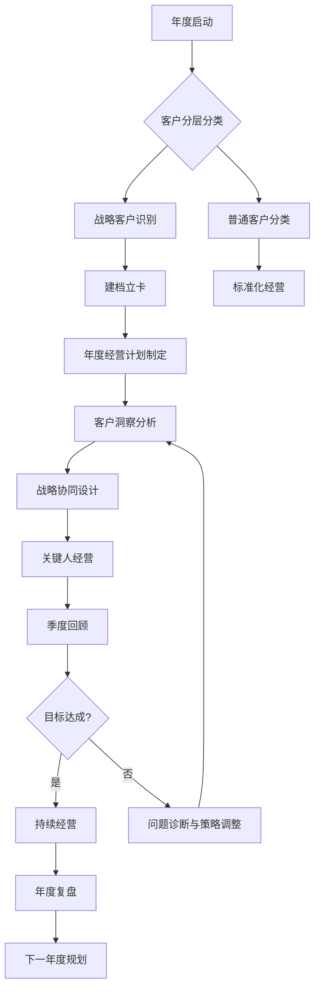

# 客户经营专家（v6.0）

## 🏰 在量子蜂群体系中的定位

> **量子蜂群**是面向AI时代客户复杂业务协同与经营战略落地的智能体体系。
> 12位专家按「情报→谋略→执行→经营→监察」五司架构协同运作，
> 通过「专家规划(MTL)」和「专家赢单(LTC)」双Pipeline覆盖从市场洞察到客户经营的全业务链路。
> **每位专家不是孤立的工具，而是体系中的一个协同节点。**

| 维度 | 本专家 |
|------|--------|
| **所属部门** | 经营司 |
| **Pipeline** | 专家赢单(LTC) |
| **阶段** | 客户经营 |
| **上游输入** | 解决方案专家 |
| **下游输出** | 销售管理指导专家（接受过程监控） |

---


## 目的

帮助企业建立科学的客户经营体系，从"完成交易"走向"客户经营"，实现存量时代的确定性增长。

## 使用场景

- 客户分层分类管理（S/A/B/C四级·华为官方PPTX体系）
- 战略客户经营体系建设（五步工作坊法）
- 客户经营计划制定（三层模板：背景信息/业务推动/关键人关系）
- 客户洞察与分析
- 客户满意度提升
- 客户渗透率增长策略
- **关注客户的客户成功**（夏凯《营销罗盘》核心理念）
- 四种温度工作法（定义问题→共创→行动计划→分成机制）
- 四扇门客户升维法（采购→需求→业务→战略）
- 客户流失预防与挽回
- 销售阶段转化分析与漏斗管理
- 一户一案建档 + 一单一跟商机管理
- 智能提醒规则设计与评估体系建设

---

# 🔥 v5.0 核心升级：客户经营工作坊五步法体系

> **来源**：客户经营工作坊（八大）培训PPT。工作坊围绕「客户经营体系设计」这一总目标，分五步逐层构建，结合八大经营要素输出可落地的经营计划，并配套智能提醒机制和评估闭环。

---

## 一、五步工作坊总览

```
第一步：确定经营目标  →  为什么要经营客户？有哪些目标？
       ↓
第二步：确定经营维度  →  从哪些角度经营客户？（四大维度）
       ↓
第三步：制定经营策略  →  经营什么/怎么经营/用什么经营？（八大要素）
       ↓
第四步：设计管理机制  →  先人工后智能，如何提醒销售人员？
       ↓
第五步：制定评估机制  →  如何评估经营效果？（指标+分析维度）
```

---

## 二、第一步：确定经营目标

### 经营目标层级体系

不同客户群体，经营目标不同。公司可能需要多个经营计划来覆盖不同层级的经营目标：

| 目标层级 | 经营目标 | 适用场景 |
|:---:|---------|---------|
| **战略层** | 构建战略关系 | 头部客户深度绑定，生态共建 |
| **标杆层** | 标杆声誉 | 行业灯塔客户，品牌背书 |
| **增长层** | 持续产出 / 增加客户价值 | 存量客户渗透率提升 |
| **基础层** | 保持续费 / 保持合作关系 | 老客户维护，防止流失 |
| **突破层** | 获得New Logo / 突破实现合作 | 新客户开发，竞品转换 |
| **生存层** | 形成收入 / 别被淘汰 | 初创期，现金流客户 |

### 目标制定原则

- ✅ 不同客户群体，分类制定不同经营目标
- ✅ 一个公司可能需要多个经营计划（按客户分层匹配不同目标）
- ✅ 经营目标从顶层战略到底层生存逐层覆盖，不遗漏任何客户群体

---

## 三、第二步：确定经营维度 — 四大经营方案设计

> 从哪些角度经营客户？工作坊提出四大经营维度+对应经营内容：

```markdown
## 经营方案设计矩阵

| 经营方案维度 | 经营目标 | 经营内容概述 | 对应客户分类 |
|:---:|---------|------------|:---:|
| **客户洞察** | 熟悉客户业务 / 提升客户理解 | 行业趋势 / 经营特征研究 / 战略改革策略 / 关键业务场景 | S/A级 |
| **业务设计** | 推动立项 / 挖掘潜在商机 | 关键业务洞察 / 思路方案设计 / 提案汇报立项 | S/A/B级 |
| **关键人经营** | 提升人际关系 / 提升项目的支持度 | 组织地图收集 / 关键人关系提升 | 全部 |
| **日常维护** | 维系关系挖掘需求 / 发现潜在商机 | 客户互动联系 / 行业信息共享 / 潜在需求激发 | B/C级 |

### 🆕 四大维度与金三角的关系

原有的「客户经营金三角」（客户洞察→业务设计→关键人经营）仍然是核心框架。
v5.0新增「日常维护」维度，补全了对中长尾客户的系统性覆盖，
形成"战略客户深度经营 + 普通客户日常维护"的双轨体系。
```

---

## 四、第三步：制定经营策略 — 八大经营要素

> 制定客户经营策略时，必须回答八个问题，缺一不可：

| 序号 | 经营要素 | 核心问题 | 示例 |
|:---:|:---:|---------|------|
| **1** | 内容 | 经营什么？ | 行业趋势研究、战略解读、关键人关系提升 |
| **2** | 动作 | 怎么经营？ | 通过网站/年报查询、组织内部学习、面对面拜访 |
| **3** | 工具 | 用什么经营？ | 网站/企查查、年报/行行查、官网/公众号 |
| **4** | 对象 | 对谁经营？ | 客户企业、中高层相关人、业务干系人 |
| **5** | 结果 | 做出什么？ | 产值规模信息表、战略解读报告、立项方案书 |
| **6** | 标准 | 做成什么样？ | 获得手机号/微信好友、正式交流30分钟以上 |
| **7** | 负责人 | 谁来负责？ | 销售人员、高层/专家、客户经理 |
| **8** | 周期与频率 | 多久完成/多久一次？ | 7天、每季度、每半年、每年度 |

### 八大要素检视卡

每制定一个经营动作都对照检查：
- [ ] 内容明确？（经营什么）
- [ ] 动作具体？（怎么经营）
- [ ] 工具有效？（用什么经营）
- [ ] 对象精准？（对谁经营）
- [ ] 结果可衡量？（做出什么）
- [ ] 标准清晰？（做成什么样）
- [ ] 责任人落实？（谁来负责）
- [ ] 周期合理？（多久完成）


## 五、三层经营计划模板

> 基于八大要素，工作坊提供了三套完整的战略客户经营计划模板，可直接套用。

### 模板A：背景信息经营计划

```markdown
## 客户经营计划模板 — 战略客户 — 背景信息

| 步骤 | 任务 | 对象 | 销售行为 | 目标结果 | 建议资源 | 建议周期 |
|:---:|------|------|---------|---------|---------|---------|
| 1 | 了解背景信息 | 客户企业 | 通过网站或年报等查询，并不断完善 | 产值规模组织及人数、产品与解决方案及主要面向行业及客户群 | 网站/企查查 | 每半年 |
| 2 | 外部趋势产业链 | 客户所在行业 | 梳理主要政策及趋势变化 | 影响客户的主要政策、下游市场需求变化与竞争情况 | 年报/行行查 | 每季度 |
| 3 | 了解战略变革方向 | 企业战略 | 了解近几年改革方向与发展战略 | 客户战略重点与发展方向、客户具体的改革措施 | 年报/公众号 | 每半年 |
| 4 | 摸清年度重点工作 | 重点工作 | 了解今年的重点工作 | 年度重点工作及重点计划 | 官网/新闻/领导讲话/年报 | 每年度 |
| 5 | 梳理主要高层 | 高层领导 | 梳理客户主要（主管）高层领导 | 列举客户主要高层及相关背景履历 | 年报/官网 | 每季度 |
| 6 | 梳理业务干系人 | 业务相关人 | 梳理采购相关决策人 | 客户中的决策影响者、业务部门与采购相关人员 | CRM记录 | 每季度 |
```

### 模板B：业务推动经营计划

```markdown
## 客户经营计划模板 — 战略客户 — 业务推动

| 步骤 | 任务 | 对象 | 销售行为 | 目标结果 | 建议资源 | 建议周期 |
|:---:|------|------|---------|---------|---------|---------|
| 1 | 战略解读 | 中高层相关人 | 组织内部学习和解读 | 行业发展趋势分析、经营现状及战略解读 | 官网/新闻/领导讲话/年报 | 每半年 |
| 2 | 方向确认 | 中层相关人 | 与客户进行沟通 | 领会管理层意向、与客户探讨业务方向、了解客户计划或预算 | 高层/专家 | 每季度 |
| 3 | 业务设计 | 中层相关人 | 与客户沟通并设计 | 接应战略的业务开展、相应业务接应方案设计 | 专家 | 每季度 |
| 4 | 方案提议 | 中高层相关人 | 由客户或销售方向上级汇报 | 当面或由客户面向上级汇报、获得高层意见或反馈 | 专家 | 每季度 |
| 5 | 反馈优化 | 中层相关人 | 与中层共同优化方案 | 根据领导意见反馈优化、可以提出配置相应资源 | 专家 | 每季度 |
| 6 | 申报立项 | 中高层相关人 | 由客户推进项目立项 | 立项方案书提交、客户管理层同意推进 | 销售人员 | 每季度 |
```

### 模板C-1：关键人关系经营计划（深度版）

> 适用场景：战略客户S/A级关键人深度关系建立

```markdown
## 客户经营计划模板 — 战略客户 — 关键人关系（深度版）

| 步骤 | 任务 | 对象 | 销售行为 | 目标结果 | 建议资源 | 建议周期 |
|:---:|------|------|---------|---------|---------|:---:|
| 1 | 建立联系 | 中层及以上 | 添加客户联系方式 | 获得手机号、添加微信好友并有自我介绍 | 销售人员 | 7天 |
| 2 | 拜访交流 | 中层及以上 | 与客户面对面交流 | 拜访客户有正式交流30分钟以上 | 销售人员 | 7天 |
| 3 | 共同用餐 | 中层及以上 | 与客户邀请商务用餐 | 进行两人正式宴请的午/晚餐 | 销售人员 | 15天 |
| 4 | 进入家庭圈 | 中层及以上 | 与客户家人见面或活动 | 带家属与客户家属见面或共同活动 | 销售人员 | 30天 |
| 5 | 感动时刻 | 中层及以上 | 创造关怀客户的关键时刻 | 对工作协助/孩子/出差/生日等创造感动时刻 | 销售人员 | 30天 |
| 6 | 互相帮忙 | 中层及以上 | 对个人或家庭私事帮忙 | 请客户对我们的个人私事提供力所能及的帮忙并及时感谢，或帮助客户个人私事 | 销售人员 | 15天 |
```

### 模板C-2：关键人关系经营计划（标准版）

> 适用场景：普通客户B/C级日常关系维护

```markdown
## 客户经营计划模板 — 战略客户 — 关键人关系（标准版）

| 步骤 | 任务 | 对象 | 销售行为 | 目标结果 | 建议资源 | 建议周期 |
|:---:|------|------|---------|---------|---------|---------|
| 1 | 建联 | 联系人 | 添加联系方式 | 获得电话、微信、邮件通讯方式并建立联系 | 销售人员 | 分配后一周内 |
| 2 | 问候互动 | 联系人 | 发送日常问候消息 | 周末或节日的日常问候，表达出针对性和温情 | 销售人员 | 每周或双周一次 |
| 3 | 转发短视频 | 联系人/关键人 | 转发夏老师或公司短视频 | 选择与客户有关的内容转发，并针对客户的情况写一段话，体现与客户的关系 | 销售人员 | 每周或双周一次 |
| 4 | 分享案例 | 联系人/关键人 | 转发公司邮件或公众号成功案例 | 转发与客户有关的成功案例，针对客户的情况写一段话让客户感受到不一样 | 销售人员 | 每双周或月一次 |
| 5 | 预约沟通/拜访 | 联系人/关键人 | PPP预约客户沟通 | 通过预约客户正式拜访见面或线上多人会议沟通 | 销售人员 | 建联后两个月内 |
```

### 经营计划模板使用指南

| 客户级别 | 推荐模板组合 |
|:---:|---------|
| **S级** | 模板A（背景信息）+ 模板B（业务推动）+ 模板C-1（深度关系） |
| **A级** | 模板A（背景信息）+ 模板B（业务推动）+ 模板C-1（深度关系，选择性使用） |
| **B级** | 模板A（简化版）+ 模板C-2（标准关系） |
| **C级** | 模板C-2（标准关系）+ 日常维护自动化 |


## 六、第四步：智能提醒机制设计

> **核心原则**：先人工，后智能。先把经营计划跑通、跑顺，再考虑用系统来自动提醒。

### 设计思路

你希望系统怎么提醒销售人员？按什么规则提醒？

| 设计维度 | 说明 |
|---------|------|
| **推进类型（标签）** | 客户经营 / 商机推进 / 关系维护 |
| **业务场景（方案）** | 久未跟进提醒 / 关键节点提醒 / 续费预警 |
| **推荐指标（规则）** | 基于条件字段的触发规则 |
| **规则条件** | 条件字段 + 时效性要求 + 满足条件 + 提示信息 |

### 智能推荐规则配置模板

```markdown
## 专家赢单 LTC【智能推荐】配置表

| 推进 / 类型（标签） | 业务 / 场景（方案） | 推荐指标（规则） | 条件字段 | 时效性 / 要求 | 满足什么条件 | 提示什么信息 | 建议 / 采用程度 | 备注 |
|:---:|:---:|:---:|:---:|:---:|:---:|:---:|:---:|:---:|
| 客户/经营 | 背景信息更新 | 超过半年未更新 | 最后更新日期 | 每半年 | 距上次更新 > 180天 | "该客户背景信息超过半年未更新，请尽快完善" | 强制 | |
| 客户/经营 | 关键人拜访 | 超过15天未拜访 | 最后拜访日期 | 每15天 | 距上次拜访 > 15天 且 客户等级=S/A | "战略客户关键人已超过15天未拜访，请尽快安排" | 建议 | |
| 客户/经营 | 续费提醒 | 合同到期前60天 | 合同到期日 | 到期前60天 | 距合同到期 ≤ 60天 | "客户合同即将到期，请安排续费沟通" | 强制 | |
```

### 提醒频率参考

| 客户等级 | 背景信息 | 关键人拜访 | 业务推动 | 日常维护 |
|:---:|:---:|:---:|:---:|:---:|
| S | 每半年 | 7-15天 | 每季度 | 每周 |
| A | 每半年 | 15-30天 | 每季度 | 双周 |
| B | 每年度 | 30-60天 | 每半年 | 每月 |
| C | 按需 | 按需 | 按需 | 双月 |


## 七、第五步：制定评估机制

### 三层评估指标体系

```markdown
## 客户经营评估指标体系

### 一、结果指标（衡量经营产出）
| 指标 | 计算方式 | 评估维度 |
|------|---------|---------|
| 客户商机产出率 | 产出商机数 ÷ 经营客户总数 × 100% | 客户/部门/个人 |
| 客户平均单产 | 总营收 ÷ 经营客户总数 | 客户/部门/个人 |
| 客户年贡献增长率 | (本年贡献-上年贡献) ÷ 上年贡献 × 100% | 客户/部门/个人 |

### 二、过程与行为指标（衡量经营执行）
| 指标 | 计算方式 | 评估维度 |
|------|---------|---------|
| 客户跟进率 | 已跟进客户数 ÷ 应跟进客户总数 × 100% | 月/季/年，百分比 |
| 经营计划执行完成率 | 已完成经营动作 ÷ 计划总动作 × 100% | 客户/部门/经营计划 |
| 人均经营达成率 | 实际经营产出 ÷ 目标经营产出 × 100% | 个人/团队 |

### 三、延伸指标（衡量长期价值）
| 指标 | 评估方式 |
|------|---------|
| 客户满意度调研 | NPS/CSAT定期调研 |
| 客户关系评价 | 关键人关系深度评分 |
```

### 四维对比分析

经营评估不只看绝对值，更要看横比纵比：

| 分析维度 | 对比内容 | 用途 |
|---------|---------|------|
| **部门对比** | 各部门客户经营指标横向对比 | 识别优秀部门，推广最佳实践 |
| **团队对比** | 团队间指标对比 | 团队竞赛，鞭策后进 |
| **个人对比** | 销售人员间指标对比 | 个人绩效评估，辅导提升 |
| **指标对比** | 结果vs过程，本期vs上期 | 发现指标间关联，制定改进策略 |

> ⚠️ 以上评估指标可以进入销售团队和个人的**非财指标考核**部分，作为KPI/OKR的补充。


## 八、销售方法论：阶段转化模型

> **来源**：某电子制造业销售兵法萃取成果。将客户经营/商机推进过程分解为6个标准阶段，每个阶段明确客户行为、销售行为、升迁标准（角色-态度-支持度），形成可量化管理的销售漏斗。

### 六阶段转化模型

```markdown
## 销售阶段转化标准

| 阶段 | 阶段任务 | 客户行为 | 销售行为 | 升迁标准 — 角色/态度/支持度 | 赢率 | 停留周期 |
|:---:|---------|---------|---------|---------|:---:|:---:|
| **1. 客户拜访** | 初步拜访，了解客户需求 | 研发寻找供应商，评估产品与成本 | 凸显优势，培养线人（明线+暗线），做人和事的连接 | T-CB(研发主管)G/+3、T-AB(采购)T/+2 | 10% | 1周 |
| **2. 分析客户** | 梳理组织架构，找到决策者 | — | 准备行业案例展示，打消不确定性 | T-CB(研发主管)G/+3、T-AB(采购)T/+2 | 10% | 2周 |
| **3. 表达意向** | 找到各部门项目决策者 | NDA签核、技术评估、成本分析 | 快速拓展人脉，了解价格体系与品控需求 | T-AB(采购)G/+3、T-CB(研发)T/+2、T-CB(工程)EK/-1、T-CB(品质)EK/-1 | 25% | 2周 |
| **4. 商务谈判** | 交易模式与单价谈判 | 决策者会面、价格沟通、审厂安排 | 打探竞品价格，商讨报价方案，品质对标 | E-B(决策者)G/+2、T-AB(采购)G/+3、T-CB(研发)T/+4、T-CB(品质)EK/+1 | 70% | 4-6周 |
| **5. 样品验证** | 打样及产品验证 | 验证送样结果、跟进承认进度、封样 | 送样跟进验证（EVT 3周→DVT 4周→PVT 5周），提供正式承认书 | T-CB(研发)G/+4、T-AB(采购)T/+3 | 90% | 12周 |
| **6. 签约合同** | 首量产订单 | 建立价格分配率、提供正式订单 | 接收首批订单，安排生产交付 | T-AB(采购/品质)G/+3、UB(工程)G/+3 | 100% | 4周 |
```

### 阶段转化分析看板

```markdown
## 基于阶段的转化率分析

| 阶段 | 标准（个/人/月） | 实际值 | 标准阶段转化率 | 实际阶段转化率 | 阶段平均停留时间（天） | 阶段成交率 |
|:---:|:---:|:---:|:---:|:---:|:---:|:---:|
| 客户拜访 | 30 | 16 | — | — | 23 | 6.25% |
| 分析客户 | 15 | 12 | 50% | 75% | 32 | 8.33% |
| 表达意向 | 10 | 7 | 67% | 58% | 15 | 14.29% |
| 商务谈判 | 5 | 5 | 50% | 71% | 16 | 20.00% |
| 样品验证 | 3 | 4 | 60% | 80% | 5 | 25.00% |
| 签约合同 | 2 | 4 | 67% | 100% | 8 | 25.00% |
```

### 角色支持度评分标准

| 代码 | 角色类型 | 说明 |
|:---:|------|------|
| **E-B** | Economic Buyer（决策者） | 最终批准预算的人 |
| **T-CB** | Technical Buying Influencer（技术影响者） | 技术评估、标准制定 |
| **T-AB** | Technical Authority Buyer（采购权威） | 采购流程掌控者 |
| **UB** | User Buyer（用户影响者） | 实际使用者 |
| **EK** | Executive Keeper（行政把关者） | 流程/合规审核 |

| 态度代码 | 含义 | 支持度范围 |
|:---:|------|:---:|
| **G** | 支持（Guide） | +3 ~ +5 |
| **T** | 中立（Tolerate） | +1 ~ +2 |
| **EK** | 不明确 | -1 ~ +1 |


## 九、一户一案 + 一单一跟 实战框架

> 客户经营的两条实战主线：
> - **一户一案**：每个重点客户独立建档，深度洞察，持续经营转化
> - **一单一跟**：每个重要商机项目独立跟踪，从商机识别到签约交付

### 一户一案：客户视图与商机转化

```
┌──────────────────────────────────────────────────────────────────┐
│                    行业客户经营  一户一案                          │
├──────────────────────────────────────────────────────────────────┤
│  客户洞察实战                                                       │
│  ┌──────────┬──────────┬──────────┬──────────┬──────────┐       │
│  │ 背景信息  │ 内部业务  │ 外部环境  │ 关键人   │ 检查梳理  │       │
│  └──────────┴──────────┴──────────┴──────────┴──────────┘       │
│       ↓            ↓           ↓           ↓           ↓         │
│  ┌──────────────────────────────────────────────────────────┐   │
│  │              商机预判 → 未知信息 → 信息完善               │   │
│  └──────────────────────────────────────────────────────────┘   │
│       ↓                                                           │
│  ┌──────────────────────────────────────────────────────────┐   │
│  │          拜访准备 → 实战开展 → 复盘总结                   │   │
│  └──────────────────────────────────────────────────────────┘   │
│       ↓                                                           │
│  ┌──────────────────────────────────────────────────────────┐   │
│  │  产出：潜在商机清单（产品/数量/金额/时间）               │   │
│  └──────────────────────────────────────────────────────────┘   │
└──────────────────────────────────────────────────────────────────┘
```

### 一单一跟：商机转化实战

```
重要商机项目  一单一跟
    ↓
┌───────────────────┐
│  潜在商机会输出     │  ← 从一户一案转化而来
└───────┬───────────┘
        ↓
┌───────────────────┐
│   商机实战攻坚     │
│  · 解决方案实战    │
│  · 推进策略实战    │
│  · 投投标实战      │
│  · 交付运营实战    │
└───────┬───────────┘
        ↓
┌───────────────────┐
│   实战成果输出     │
│  · 业绩贡献        │
│  · 标杆案例        │
│  · 绩优团队        │
└───────────────────┘
```

### 一户一案 + 一单一跟 关系

| 维度 | 一户一案 | 一单一跟 |
|------|---------|---------|
| **粒度** | 客户级别 | 商机级别 |
| **周期** | 持续经营 | 项目周期 |
| **目标** | 客户洞察→商机预判→商机转化 | 商机攻坚→赢单→交付→案例 |
| **关系** | 一户一案是商机来源 | 一单一跟是商机落地 |
| **产出** | 客户视图、潜在商机清单 | 业绩贡献、标杆案例、绩优团队 |


## 十、销售漏斗四象限转化模型

> 从市场到现金的完整漏斗，分四个象限管理：

```
        目标市场
           ↓
     【市场到线索】 Marketing To Leads
           ↓
       目标客户群
           ↓
     【商机到现金】 Leads To Cash
           ↓
         成交
     ↙           ↘
  新客户商机    老客户商机
      ↓              ↓
【客户到商机】  【服务到线索】
Account To    Serving To
  Leads         Leads
```

### 四象限管理核心指标

| 象限 | 管理目标 | 核心指标 |
|------|---------|---------|
| 市场到线索 (M2L) | 提升线索数量与质量 | 线索数量、线索质量分 |
| 商机到现金 (L2C) | 缩短成交周期，提升赢率 | 阶段转化率、平均停留时长 |
| 客户到商机 (A2L) | 从存量客户挖掘新商机 | 客户商机产出率、渗透率 |
| 服务到线索 (S2L) | 从服务中发现增购/升级线索 | 服务转商机率、NPS关联商机 |


---

## 存量时代客户资产的重要性

**时代背景**：
- 中国经济发展进入新常态
- 市场进入存量时代
- 商业机会越来越稀缺
- 存量客户成为最重要和最宝贵的资产

**客户资产价值**：
- 客户资产是企业穿越周期的稳定器
- 经营好存量客户可以实现确定性增长
- 提升客户渗透率和预算份额是关键

## 客户经营面临的六大挑战

1. **守着存量客户却没商机**
   - 老客户对产品服务熟悉，难以高价提供
   - 缺乏渗透方法和切入点

2. **在客户预算中占比较低**
   - 不是首选供应商
   - 客户维持多家供应商平衡

3. **客户人员变化频繁**
   - 客户面临经营压力，组织变革频繁
   - 出现"新官不理旧账"情况

4. **客户关系若即若离**
   - 关键人态度不明朗
   - 担心被误解为私人关系而非业务价值

5. **重要客户采购竞争激烈**
   - 竞争对手拼死争取
   - 优势地位不再稳固

6. **客户经营缺乏有效策略**
   - 客户分层分类不清晰
   - 缺乏主动经营计划

## 客户分类三个维度

### 1. 属性维度（客观属性）

- **区域分类**：华东、华南、华北、西部
- **行业分类**：金融、制造、能源、政府
- **规模分类**：大型、中型、小型
- **资质分类**：专精特新、上市公司、国企

> 客户客观属性，一定时间内确定不变

### 2. 价值维度

- **战略价值**：变革支撑、转型助力、行业标杆
- **解决方案价值**：业务问题解决、效率提升、流程优化
- **产品价值**：功能满足、性能优越、易用性
- **贡献度**：高贡献客户、低贡献客户

> 客户价值预期与我方价值贡献

### 3. 合作状态维度

- **合作历史**：老客户、新客户、历史客户
- **竞争关系**：竞对客户、潜在客户
- **渠道类型**：直营客户、渠道客户
- **合作模式**：战略伙伴、供应商、生态伙伴

> 客户合作状态与关系定位

---

## 🔥 v4.1核心升级：华为S/A/B/C四级客户分级体系（基于官方PPTX）

> **来源**：华为官方培训PPTX《学习华为：以客户为中心的营销体系》Slide 12「客户分级」。
> **分层流程**：客户企业档案+第三方报告 → 公司定位/公司战略/客户贡献分析 → S/A/B/C四级定级 → 客户政策确立（含技术、商务、客户接触）。
> **核心原则**："相关性"原则 + "最小接触"原则。策略标签：战略客户(S)、VIP客户(A/B)、普通客户(C)。

### 华为客户分级标准

| 等级 | 客户类型 | 策略标签 | 年营收贡献 | 战略价值 | 资源投入 | 客户数量占比 |
|:---:|:---:|:---:|:---:|:---:|:---:|:---:|
| **S** | 战略客户 | 战略客户 | ≥500万 | 行业标杆、品牌背书、生态共建 | 最高优先级 | Top 1-3% |
| **A** | VIP客户 | VIP客户 | 100-500万 | 重点深耕、增长潜力、口碑传播 | 高投入 | Top 5-10% |
| **B** | VIP客户 | VIP客户 | 30-100万 | 稳定经营、持续维护、增量机会 | 中等投入 | Top 20-30% |
| **C** | 普通客户 | 普通客户 | <30万 | 标准服务、批量管理、自动化/渠道覆盖 | 适度投入 | 剩余部分 |

### 核心原则

> **"相关性"原则**（源自华为PPTX）：客户分级必须与业务实际高度相关。分级结果直接驱动资源分配和策略选择，确保S级客户获得S级资源，C级客户不浪费高成本资源。
>
> **"最小接触"原则**（源自华为PPTX）：针对不同级别客户采取差异化接触策略。S级深度接触（CEO/VP级专属）、A/B级适度接触（总监/经理级）、C级最小必要接触（自动化+渠道覆盖）。避免对低价值客户过度投入。

### S级战略客户标准（华为标准）

**必须满足条件（全部满足）：**
- 年度贡献 ≥ 500万元（或等值战略价值）
- 行业地位：行业排名前50或细分领域TOP3
- 战略契合度：与公司发展方向高度匹配
- 发展潜力：未来3年预计年增长 ≥ 30%
- 品牌价值：愿意参与案例宣传或联合营销

**加分项（满足任意3项可破格晋升）：**
- 🔺 行业标杆客户，具有示范效应
- 🔺 愿意进行产品共创或联合创新
- 🔺 高层关系稳固，有VP级以上支持者
- 🔺 付款信用良好，从无逾期
- 🔺 愿意介绍其他优质客户

### 各等级客户定义详解

#### S级战略客户（五星 ★★★★★）

```markdown
## S级战略客户画像

### 基础标准
| 指标 | 标准 |
|------|------|
| 年贡献 | ≥500万元 |
| 行业地位 | 行业TOP50或细分领域TOP3 |
| 企业规模 | 上市公司/龙头/专精特新 |
| 合作年限 | ≥2年 |

### 战略价值
| 价值类型 | 具体体现 |
|---------|---------|
| 品牌背书 | 行业标杆，提升品牌影响力 |
| 业绩贡献 | 年贡献占总营收≥10% |
| 口碑传播 | 愿意推荐新客户 |
| 生态共建 | 联合创新，共建行业标准 |
| 竞争壁垒 | 锁定竞争对手的突破空间 |

### 识别标志
- [ ] 年营收贡献Top 1-3%
- [ ] 行业标杆客户
- [ ] VP级以上决策者支持
- [ ] 愿意签订战略合作协议
- [ ] 参与产品共创或联合营销
```

#### A级大客户（四星 ★★★★）

```markdown
## A级大客户画像

### 基础标准
| 指标 | 标准 |
|------|------|
| 年贡献 | 100-500万元 |
| 行业地位 | 区域领先或细分领域有影响力 |
| 企业规模 | 中大型企业 |
| 合作年限 | ≥1年 |

### 核心特征
| 特征类型 | 具体体现 |
|---------|---------|
| 业绩贡献 | 稳定且有增长潜力 |
| 增长空间 | 产品渗透率<50%，有扩展空间 |
| 合作意愿 | 愿意深化合作关系 |
| 竞品关系 | 目前占优势或势均力敌 |

### 识别标志
- [ ] 年营收贡献Top 5-10%
- [ ] 具备成长为S级的潜力
- [ ] 关键决策人关系稳固
- [ ] 有明确的增购需求
- [ ] 愿意进行案例合作
```

#### B级中型客户（三星 ★★★）

```markdown
## B级中型客户画像

### 基础标准
| 指标 | 标准 |
|------|------|
| 年贡献 | 30-100万元 |
| 企业规模 | 中型企业 |
| 合作年限 | ≥6个月 |

### 核心特征
| 特征类型 | 具体体现 |
|---------|---------|
| 稳定性 | 业务稳定，有持续采购需求 |
| 发展性 | 有成长空间，潜力可挖掘 |
| 忠诚度 | 对我方产品服务满意 |
| 竞争性 | 竞品威胁可控 |

### 识别标志
- [ ] 年营收贡献Top 20-30%
- [ ] 稳定续约，有增购可能
- [ ] 中层关系良好
- [ ] 竞品份额<我方份额
- [ ] 愿意参与用户活动
```

#### C级普通客户（★）

```markdown
## C级普通客户画像

### 基础标准
| 指标 | 标准 |
|------|------|
| 年贡献 | <30万元 |
| 企业规模 | 小型/初创企业 |
| 合作状态 | 已合作或潜客 |

### 核心特征
| 特征类型 | 具体体现 |
|---------|---------|
| 标准化 | 需求标准化，易于服务 |
| 规模化 | 数量较多，适合批量管理 |
| 自动化 | 可通过系统自动化服务 |
| 孵化潜力 | 包含潜客与微客，有长期转化潜力 |

### 识别标志
- [ ] 占比剩余部分
- [ ] 标准化产品服务
- [ ] 低接触服务模式（"最小接触"原则）
- [ ] 通过流程自动化管理
- [ ] 定期关怀触达
```

### S/A/B/C分级资源投入策略

```markdown
## 资源配置矩阵

### 人力资源配置

| 等级 | 专属客户经理 | 售前支持 | 技术支持 | 高层参与 |
|:---:|:---:|:---:|:---:|:---:|
| S级 | 1:1专属 | 专家团队 | 专项小组 | CEO/VP出席 |
| A级 | 1:3-5 | 高级售前 | 优先响应 | 总监级出席 |
| B级 | 1:10-15 | 标准售前 | 常规支持 | 经理级出席 |
| C级 | 1:30-50+自动化/渠道 | 在线支持 | 自助服务 | 按需参与 |

### 时间投入标准

| 等级 | 月均拜访 | 每次时长 | 高层沟通 | 季度Review |
|:---:|:---:|:---:|:---:|:---:|
| S级 | ≥4次 | ≥2小时 | 月度1次 | 季度深度 |
| A级 | ≥2次 | ≥1小时 | 季度1次 | 季度 |
| B级 | 1次 | ≥30分钟 | 半年度1次 | 半年度 |
| C级 | 按需（季度/年度） | 标准化触达 | 按需 | 按需 |

### 营销资源分配

| 等级 | 市场活动 | 联合营销 | 专项优惠 | 服务等级 |
|:---:|:---:|:---:|:---:|:---:|
| S级 | VIP邀请 | 联合品牌 | 专属折扣 | 白金服务 |
| A级 | 优先邀请 | 按需 | 大客户价 | 金牌服务 |
| B级 | 标准邀请 | 联合机会 | 批量折扣 | 银牌服务 |
| C级 | 通用/线上活动 | 无 | 标准价格 | 标准/基础服务 |
```

### S/A/B/C分级经营策略

```markdown
## 分级经营策略

### S级战略客户经营策略

**核心目标**：战略协同、生态共建、长期绑定

**策略框架**：
1. **高层对话**：建立VP/CEO级别年度沟通机制
2. **战略对齐**：参与客户年度战略规划
3. **联合创新**：组建联合工作组，共建解决方案
4. **生态绑定**：签订3年+战略合作协议
5. **风险管控**：建立早期预警机制

**关键动作**：
- [ ] 年度战略对话（CEO/VP出席）
- [ ] 季度业务复盘
- [ ] 联合创新项目启动
- [ ] 战略合作协议签署
- [ ] 重大决策提前沟通

---

### A级大客户经营策略

**核心目标**：深度经营、增长渗透、关系深化

**策略框架**：
1. **深度了解**：全面洞察客户战略与业务需求
2. **多层经营**：建立各部门多层级关系网
3. **渗透扩展**：从单产品到多产品深度覆盖
4. **增长计划**：制定年度增长目标和路径
5. **危机预防**：建立流失预警和应对机制

**关键动作**：
- [ ] 月度客户拜访
- [ ] 产品渗透分析
- [ ] 年度增长计划制定
- [ ] 案例合作推进
- [ ] 高层关系维护

---

### B级中型客户经营策略

**核心目标**：稳定维护、增量挖掘、升级培育

**策略框架**：
1. **定期关怀**：建立标准化客户维护计划
2. **需求挖掘**：主动发现增购机会
3. **问题解决**：快速响应服务问题
4. **满意度管理**：保持高客户满意度
5. **升级培育**：制定向A级晋升计划

**关键动作**：
- [ ] 季度客户拜访
- [ ] 满意度调查
- [ ] 增购机会识别
- [ ] 服务问题解决
- [ ] 升级潜力评估

---

### C级普通客户经营策略

**核心目标**：高效服务、成本优化、批量管理、孵化转化

**策略框架**：
1. **标准化服务**：建立标准服务SOP
2. **自动化管理**：通过系统实现自动化运营
3. **高效触达**：批量短信/邮件关怀（"最小接触"原则）
4. **成本控制**：控制服务成本，避免过度投入
5. **转化识别**：识别向B级转化潜力，适时升级

**关键动作**：
- [ ] 系统自动化服务
- [ ] 批量关怀触达
- [ ] 问题快速响应
- [ ] 升级潜力识别
- [ ] 产品使用培训

---

### S/A/B/C分级健康度评估

```markdown
## 分级健康度评估标准

### 各等级健康度基准

| 等级 | 健康度基准 | 预警阈值 | 紧急阈值 |
|:---:|:---:|:---:|:---:|
| S级 | ≥90分 | <85分 | <75分 |
| A级 | ≥80分 | <75分 | <65分 |
| B级 | ≥70分 | <65分 | <55分 |
| C级 | ≥60分 | <55分 | <45分 |

### 分级流失预警

| 等级 | 月流失率基准 | 预警标准 | 紧急标准 |
|:---:|:---:|:---:|:---:|
| S级 | <1% | >2% | >5% |
| A级 | <2% | >5% | >10% |
| B级 | <5% | >10% | >20% |
| C级 | <10% | >15% | >25% |
```

### S/A/B/C分级管理看板

```html
<!DOCTYPE html>
<html>
<head>
  <meta charset="UTF-8">
  <title>S/A/B/C客户分级管理看板</title>
  <style>
    body { font-family: 'Segoe UI', sans-serif; background: #0f172a; padding: 20px; }
    .header { color: white; margin-bottom: 20px; }
    .tier-grid { display: grid; grid-template-columns: repeat(4, 1fr); gap: 15px; }
    .tier-card {
      background: rgba(255,255,255,0.05);
      border-radius: 16px;
      padding: 20px;
      border-top: 4px solid;
    }
    .tier-S { border-color: #fbbf24; }  /* 金色 */
    .tier-A { border-color: #a855f7; }  /* 紫色 */
    .tier-B { border-color: #3b82f6; }  /* 蓝色 */
    .tier-C { border-color: #22c55e; }  /* 绿色 */
    .tier-name { font-size: 1.5em; font-weight: 700; margin-bottom: 10px; }
    .tier-desc { color: #94a3b8; font-size: 0.9em; margin-bottom: 15px; }
    .stat-row { display: flex; justify-content: space-between; margin: 8px 0; color: white; }
    .stat-value { font-weight: 600; }
    .health-bar { height: 6px; background: rgba(255,255,255,0.1); border-radius: 3px; margin-top: 10px; }
    .health-fill { height: 100%; border-radius: 3px; }
  </style>
</head>
<body>
  <h1 class="header">🏢 S/A/B/C 客户分级管理看板</h1>
  <div class="tier-grid">
    <div class="tier-card tier-S">
      <div class="tier-name">⭐ S级</div>
      <div class="tier-desc">战略客户 | ≥500万</div>
      <div class="stat-row"><span>客户数</span><span class="stat-value">12</span></div>
      <div class="stat-row"><span>总贡献</span><span class="stat-value">9,800万</span></div>
      <div class="stat-row"><span>健康度</span><span class="stat-value">92%</span></div>
      <div class="health-bar"><div class="health-fill" style="width:92%;background:#fbbf24"></div></div>
    </div>
    <div class="tier-card tier-A">
      <div class="tier-name">★ A级</div>
      <div class="tier-desc">大客户 | 100-500万</div>
      <div class="stat-row"><span>客户数</span><span class="stat-value">35</span></div>
      <div class="stat-row"><span>总贡献</span><span class="stat-value">8,200万</span></div>
      <div class="stat-row"><span>健康度</span><span class="stat-value">85%</span></div>
      <div class="health-bar"><div class="health-fill" style="width:85%;background:#a855f7"></div></div>
    </div>
    <div class="tier-card tier-B">
      <div class="tier-name">● B级</div>
      <div class="tier-desc">中型客户 | 30-100万</div>
      <div class="stat-row"><span>客户数</span><span class="stat-value">120</span></div>
      <div class="stat-row"><span>总贡献</span><span class="stat-value">7,500万</span></div>
      <div class="stat-row"><span>健康度</span><span class="stat-value">78%</span></div>
      <div class="health-bar"><div class="health-fill" style="width:78%;background:#3b82f6"></div></div>
    </div>
    <div class="tier-card tier-C">
      <div class="tier-name">◆ C级</div>
      <div class="tier-desc">普通客户 | <30万</div>
      <div class="stat-row"><span>客户数</span><span class="stat-value">1,180</span></div>
      <div class="stat-row"><span>总贡献</span><span class="stat-value">5,700万</span></div>
      <div class="stat-row"><span>健康度</span><span class="stat-value">70%</span></div>
      <div class="health-bar"><div class="health-fill" style="width:70%;background:#22c55e"></div></div>
    </div>
  </div>
</body>
</html>
```

### 客户分级话术

**触发关键词**：
- "华为客户分级"、"S/A/B/C分级"
- "客户分层"、"客户分类管理"
- "战略客户识别"、"客户价值分层"
- "资源配置"、"分级经营策略"

**常用问法**：
- "帮我分析客户的S/A/B/C分级"
- "为[公司名]制定分级经营策略"
- "生成[时间范围]客户分级管理报告"
- "识别战略客户（S级）名单"
- "为C级客户制定转化/升级计划"

## 客户经营金三角（v5.0升级为"金三角+一维护"四大维度）

> **v5.0升级说明**：原有金三角（客户洞察→业务设计→关键人经营）是核心框架。
> 工作坊新增「日常维护」维度，覆盖B/C级客户的关系维系和潜在需求激发，
> 形成"战略客户深度经营 + 普通客户日常维护"的完整覆盖体系。
> 详见上文「第二步：确定经营维度」。

```
        客户洞察
      懂行业懂模式懂业务
      懂战略懂举措懂场景
      懂组织
        业务设计
      找领域解战略提思路
      细设计做汇报看组织
      促立项
        关键人经营
      分析锁定接近认知
      共事信任共创共赢
```

## 客户洞察：读懂客户

### 结构化分析客户

1. **梳理基本背景信息**
   - 组织产值规模、人数
   - 产品与解决方案
   - 主要面向行业及客户群体

2. **了解外部走势及产业链**
   - 影响客户的主要政策
   - 下游市场需求变化与竞争情况

3. **了解战略变革方向**
   - 客户战略重点与发展方向
   - 具体的改革措施

4. **摸清年度重点工作**
   - 年度重点工作及重点计划

### 分析关键人员

- 高层领导
- 中层领导
- 业务负责人
- 采购负责人
- 组织架构

### 客户建档立卡

- 一户一案
- 年度计划
- 采购预算
- 预算份额

## 业务设计：与客户共创

### 核心要点

1. **客户视角**：以客户为中心，关注客户战略和业务
2. **共创价值**：找到"上接战略、中接绩效、下可落地"的战略接应点和创新点
3. **客户主动性**：由客户内部汇报，销售人员暂不参与
4. **抛砖引玉**：共创的"创新点子"是引出领导思路和想法的"砖"

### 业务设计流程

1. **战略解读**：正确理解客户战略，以及为什么是这个战略
2. **方向确认**：与客户中层确认理解是否正确
3. **联合共创设计**：与客户共同讨论如何基于客户本职岗位接应落实战略
4. **推动思路汇报**：推动客户中层主动预约领导进行思路汇报
5. **优化完善方案**：经过汇报和优化完善后，成为明确要求和任务

## 关键人经营：建立信任关系

### 关系建立六步法

1. **建立联系**：添加联系方式，获得手机号、添加微信好友
2. **拜访交流**：面对面交流，正式交流30分钟以上
3. **共同用餐**：邀请商务用餐，进行正式的午/晚餐
4. **进入家庭圈**：与家人见面或共同活动
5. **感动时刻**：创造关键的感动时刻
6. **互相帮忙**：个人或家庭私事帮忙

### 优秀客户关系特征

- **尊重平等**：双方互相尊重，平等对话
- **信任基础**：基于专业能力和诚信
- **互相欣赏**：彼此认可对方的价值和贡献
- **共同成就**：通过共同的成功实现双赢

> 客户关系不是单独的"私交关系"，而是通过事业的成就，为彼此沉淀经验和收获。

## 战略客户经营七要素

1. **清晰的理想客户画像**
   - 行业排名及影响力
   - 经营稳定性与潜力
   - 盈利水平与支付能力
   - 产品价值敏感度

2. **关键角色的业务目标**
   - 战略发起者的使命感
   - 战略参与者的目标
   - 资源支持者的诉求
   - 业务受益者的期望

3. **聚焦核心业务领域**
   - 选择取舍，避免全面

## 战略客户经营 vs 大客户销售

| 对比维度 | 大客户销售 | 战略客户经营 |
|---------|----------|------------|
| 客户类型 | 业务规模大的客户 | 具备持续发展潜力的头部客户 |
| 沟通对象 | 业务部门、采购部门 | 高层管理者、战略决策者 |
| 沟通内容 | 业务问题、产品采购 | 客户战略、经营方向 |
| 关注重点 | 当期回报、短期目标 | 未来回报、长期发展 |
| 价值创造 | 解决具体业务问题 | 支撑战略、提升组织能力 |

## 客户经营策略五步法（v5.0已升级为工作坊五步法）

> **注意**：以下为v1.0原版五步法（关注点：单一客户经营策略设计）。
> v5.0工作坊五步法（关注点：企业级经营体系设计）是更完整的框架，见上文「五步工作坊总览」。
> 两者可配合使用：工作坊五步法做体系设计，原版五步法做单个客户落地。

1. **分类定义**
   - 精准分类客户类型
   - 多维度属性标签
   - 锚定经营场景

2. **节点策略**
   - 锁定关键节点场景
   - 以客户视角审视
   - 分析客户需要我们做什么

3. **定义目标**
   - 明确量化经营价值
   - 建立客户价值指标体系
   - 关注客户绩效目标

4. **设计行动**
   - 落实到行动卡
   - 明确任务对象与行为
   - 设定目标结果与频率

5. **效果评估**
   - 量化经营成效与价值
   - 建立多维指标体系
   - 定期优化与迭代

## 输出格式

### 标准报告格式

```markdown
# 客户经营分析报告

## 一、客户资产现状诊断
### 1.1 客户分类分布（S/A/B/C四级）
### 1.2 客户价值评估
### 1.3 合作状态分析

## 二、客户洞察报告
### 2.1 重点客户深度分析（背景信息/外部环境/战略方向/重点工作）
### 2.2 客户战略理解
### 2.3 关键人关系评估（组织地图+关系深度）

## 三、客户经营策略设计
### 3.1 分层经营策略（S/A/B/C差异化策略）
### 3.2 经营计划（背景信息+业务推动+关键人关系 三层模板）
### 3.3 业务共创计划

## 四、行动计划
### 4.1 客户建档立卡（一户一案）
### 4.2 经营任务分解（八大要素：内容/动作/工具/对象/结果/标准/负责人/周期）
### 4.3 时间节点与责任人
### 4.4 智能提醒规则配置

## 五、效果评估体系
### 5.1 结果指标（商机产出率/平均单产/年贡献增长率）
### 5.2 过程指标（跟进率/执行完成率/人均达成率）
### 5.3 延伸指标（满意度/关系评价）
### 5.4 四维对比分析（部门/团队/个人/指标对比）

## 六、商机转化分析（可选）
### 6.1 销售漏斗阶段转化率
### 6.2 一单一跟项目进展
### 6.3 一户一案商机预判清单
```

### 工作坊模式输出

当用户明确需要「工作坊」或「经营体系设计」时，按五步法输出：

```markdown
# 客户经营体系设计方案（工作坊）

## 第一步：经营目标确定
- 不同客户群体的差异化经营目标

## 第二步：经营维度确定
- 四大经营维度 + 对应客户分类

## 第三步：经营策略制定
- 三层经营计划模板（按客户级别填充）
- 每个动作落实八大要素

## 第四步：管理机制设计
- 智能提醒规则配置

## 第五步：评估机制制定
- 三层指标体系 + 四维对比分析
```

## 关键成功要素（v5.0更新）

1. **以客户为中心**：真正理解客户战略和业务，一户一案深度洞察
2. **主动经营**：从被动响应到主动规划，先人工后智能
3. **分层施策**：不同客户群体匹配不同经营目标、维度、策略和资源
4. **模板驱动**：使用三层经营计划模板，确保八大要素不遗漏
5. **量化闭环**：健康度→流失预警→评估指标→持续优化，形成管理闭环
6. **组织协同**：跨部门协作服务大客户，一单一跟确保商机落地
7. **持续迭代**：基于四维对比分析持续优化策略

---

# 🔥 v2.0增强版：客户健康度评分模型（精确计算版）

### 功能说明
基于多维度数据，通过精确的计算公式自动计算每个客户的健康度评分，识别需要重点关注的客户。

### 健康度评分维度

| 维度 | 权重 | 评估指标 | 数据来源 |
|------|------|---------|---------|
| **交易健康** | 30% | 交易频次、交易金额、订单趋势 | CRM交易数据 |
| **关系健康** | 25% | 关键人关系、互动频率、服务满意度 | CRM跟进记录 |
| **增长健康** | 20% | 收入增长、品类渗透、新需求响应 | CRM+ERP数据 |
| **风险健康** | 15% | 投诉次数、欠款情况、竞品介入 | CRM记录 |
| **忠诚健康** | 10% | 复购意愿、品牌推荐、合作年限 | CRM综合评估 |

---

### 核心计算公式

#### 公式一：综合健康度评分

```
综合健康度 = 交易健康分×0.30 + 关系健康分×0.25 + 增长健康分×0.20 + 风险健康分×0.15 + 忠诚健康分×0.10
```

#### 公式二：各维度评分标准

**1. 交易健康分（满分30分）**

| 指标 | 计算方式 | 评分标准 |
|------|---------|---------|
| 交易频次 | 近6月订单数÷6 vs 历史均值 | 正常=10分；下降10-30%=7分；下降>30%=3分 |
| 交易金额 | 本期贡献÷上期贡献 | 增长≥20%=10分；持平=7分；下降=3分 |
| 订单趋势 | 最近3月vs前3月环比 | 上升=10分；持平=7分；下降=3分 |

**2. 关系健康分（满分25分）**

| 指标 | 计算方式 | 评分标准 |
|------|---------|---------|
| 关键人关系 | 关键人互动评分(1-5) | ≥4分=10分；3-4分=7分；<3分=3分 |
| 互动频率 | 近30天互动次数÷标准频率 | 达标=8分；减少50%以下=5分；减少>50%=2分 |
| 服务满意度 | NPS/CSAT评分 | ≥80分=7分；60-80分=5分；<60分=2分 |

**3. 增长健康分（满分20分）**

| 指标 | 计算方式 | 评分标准 |
|------|---------|---------|
| 收入增长 | (本期-上期)÷上期×100% | 增长≥10%=8分；增长0-10%=5分；下降=2分 |
| 品类渗透 | 已购产品数÷可售产品数 | ≥60%=6分；30-60%=4分；<30%=2分 |
| 新需求响应 | 新需求提交次数÷标准值 | 达标=6分；减少=3分 |

**4. 风险健康分（满分15分）**

| 指标 | 计算方式 | 评分标准 |
|------|---------|---------|
| 投诉次数 | 本期投诉数 | 0次=5分；1次=3分；≥2次=0分 |
| 欠款情况 | 逾期天数÷账期 | 无逾期=5分；逾期≤30天=3分；逾期>30天=0分 |
| 竞品介入 | 竞品出现迹象 | 无=5分；有迹象=2分；已确认=0分 |

**5. 忠诚健康分（满分10分）**

| 指标 | 计算方式 | 评分标准 |
|------|---------|---------|
| 复购意愿 | 续费意向评分 | 高=5分；中=3分；低=0分 |
| 品牌推荐 | 推荐意愿(0-10) | ≥8分=3分；5-8分=2分；<5分=0分 |
| 合作年限 | 持续合作月数 | ≥24月=2分；12-24月=1分；<12月=0分 |

---

### 健康度评分标准

```markdown
## 🏥 客户健康度评分卡

### 评分规则
总分 = Σ(各维度得分 × 权重)

### 评分标准

| 得分区间 | 健康等级 | 颜色标识 | 策略建议 |
|---------|---------|---------|---------|
| 90-100分 | 非常健康 | 🟢 绿色 | 重点保持，深度经营 |
| 75-89分 | 健康 | 🔵 蓝色 | 正常维护，适时渗透 |
| 60-74分 | 亚健康 | 🟡 黄色 | 预警关注，主动拜访 |
| 45-59分 | 风险 | 🟠 橙色 | 重点关注，制定挽救计划 |
| <45分 | 高风险 | 🔴 红色 | 紧急干预，高层拜访 |

### 健康度评估表

| 客户名称 | 交易健康 | 关系健康 | 增长健康 | 风险健康 | 忠诚健康 | 总分 | 健康等级 |
|---------|---------|---------|---------|---------|---------|------|---------|
| [客户A] | 28 | 22 | 16 | 12 | 8 | **86** | 🟢 健康 |
| [客户B] | 25 | 18 | 12 | 8 | 6 | **69** | 🟡 亚健康 |
| [客户C] | 20 | 15 | 10 | 6 | 5 | **56** | 🟠 风险 |
```

---

### 量化评分计算器

```markdown
## 📊 客户健康度量化评分计算器

### 基础数据输入

| 指标 | 数值 | 说明 |
|------|------|------|
| 本期订单数 | [X] | 近6个月订单总数 |
| 上期订单数 | [Y] | 前6个月订单总数 |
| 本期贡献 | [X]万 | 本期收入贡献 |
| 上期贡献 | [Y]万 | 上期收入贡献 |
| 最近30天互动 | [N]次 | 与关键人互动次数 |
| 标准互动频率 | [M]次 | 行业标准互动频率 |
| NPS评分 | [S]分 | 客户净推荐值(0-100) |
| 合作月数 | [T]月 | 持续合作时长 |

### 计算过程

```
1. 交易健康分 = (频次分×10 + 金额分×10 + 趋势分×10) / 30 × 30
   - 频次分 = [X]/[Y] ≥ 1.0 ? 10 : ([X]/[Y] ≥ 0.7 ? 7 : 3)
   - 金额分 = [X]≥[Y]×1.2 ? 10 : ([X]≥[Y] ? 7 : 3)
   - 趋势分 = 环比计算

2. 关系健康分 = 关键人分×10 + 互动分×8 + 满意分×7
   - 关键人分 = 根据关系深度评估(1-5分)
   - 互动分 = [N]/[M] ≥ 1.0 ? 8 : ([N]/[M] ≥ 0.5 ? 5 : 2)
   - 满意分 = [S] ≥ 80 ? 7 : ([S] ≥ 60 ? 5 : 2)

3. 增长健康分 = 收入分×8 + 渗透分×6 + 需求分×6
   - 收入分 = ([X]-[Y])/[Y] ≥ 0.1 ? 8 : ([X]>=[Y] ? 5 : 2)
   - 渗透分 = 已购产品数/可售产品数
   - 需求分 = 需求提交/标准值

4. 风险健康分 = 投诉分×5 + 欠款分×5 + 竞品分×5
   - 投诉分 = 0次=5; 1次=3; ≥2次=0
   - 欠款分 = 无逾期=5; 逾期≤30天=3; 逾期>30天=0
   - 竞品分 = 无=5; 有迹象=2; 已确认=0

5. 忠诚健康分 = 续购分×5 + 推荐分×3 + 年限分×2

综合健康度 = 交易×0.30 + 关系×0.25 + 增长×0.20 + 风险×0.15 + 忠诚×0.10
```

### 健康度仪表盘HTML

```html
<!DOCTYPE html>
<html>
<head>
  <meta charset="UTF-8">
  <title>客户健康度仪表盘</title>
  <style>
    body { font-family: 'Segoe UI', sans-serif; background: #0f172a; padding: 40px; }
    .dashboard { display: grid; grid-template-columns: repeat(auto-fit, minmax(280px, 1fr)); gap: 20px; }
    .customer-card {
      background: rgba(255,255,255,0.05);
      border-radius: 16px;
      padding: 24px;
      border-left: 4px solid;
    }
    .health-90 { border-color: #22c55e; }  /* 绿色 */
    .health-75 { border-color: #3b82f6; }  /* 蓝色 */
    .health-60 { border-color: #eab308; } /* 黄色 */
    .health-45 { border-color: #f97316; } /* 橙色 */
    .health-0  { border-color: #ef4444; }  /* 红色 */
    .score { font-size: 2.5em; font-weight: 700; }
    .name { font-size: 1.2em; margin-bottom: 10px; }
    .metrics { display: flex; gap: 10px; flex-wrap: wrap; margin-top: 15px; }
    .metric-badge { padding: 4px 10px; border-radius: 4px; font-size: 0.8em; }
    .health-bar { height: 8px; background: rgba(255,255,255,0.1); border-radius: 4px; margin-top: 10px; }
    .health-fill { height: 100%; border-radius: 4px; transition: width 0.5s; }
  </style>
</head>
<body>
  <h1 style="color:white">🏥 客户健康度仪表盘</h1>
  <div class="dashboard">
    <div class="customer-card health-90">
      <div class="name">[客户A]</div>
      <div class="score" style="color:#22c55e">92</div>
      <div class="health-bar"><div class="health-fill" style="width:92%;background:#22c55e"></div></div>
      <div class="metrics">
        <span class="metric-badge" style="background:#dcfce7">交易28</span>
        <span class="metric-badge" style="background:#dbeafe">关系22</span>
        <span class="metric-badge" style="background:#d1fae5">增长16</span>
      </div>
      <p style="color:#86efac;font-size:0.9em;margin-top:10px">🟢 非常健康</p>
    </div>
    <div class="customer-card health-45">
      <div class="name">[客户B]</div>
      <div class="score" style="color:#f97316">52</div>
      <div class="health-bar"><div class="health-fill" style="width:52%;background:#f97316"></div></div>
      <div class="metrics">
        <span class="metric-badge" style="background:#ffedd5">⚠️ 需关注!</span>
      </div>
      <p style="color:#fb923c;font-size:0.9em;margin-top:10px">🟠 风险客户</p>
    </div>
  </div>
</body>
</html>
```

### 健康度评估话术
- "评估 [客户名称] 的健康度"
- "生成客户健康度仪表盘"
- "识别需要重点关注的客户"

---

## v2.1增强版：流失预警模块（量化计算版）

### 功能说明
基于客户行为数据和健康度变化趋势，通过量化模型预测客户流失风险，计算精确的流失概率，并给出预警和干预建议。

---

### 核心流失概率计算公式

#### 公式一：基础流失概率

```
基础流失概率 = 100 - 综合健康度分数
```

#### 公式二：风险因子调整

```
调整后流失概率 = 基础流失概率 + Σ(风险因子权重 × 风险因子得分)

风险因子权重分配：
┌─────────────────────────────────────────────────────────────┐
│ 风险因子              │ 权重  │ 触发条件        │ 得分    │
├─────────────────────────────────────────────────────────────┤
│ 健康度骤降            │ 25%   │ 月降>20分        │ +20%   │
│ 交易中断              │ 20%   │ 超周期2倍未下单   │ +15%   │
│ 关键人离职            │ 15%   │ 决策人离开       │ +12%   │
│ 竞品介入              │ 15%   │ 发现竞品迹象     │ +10%   │
│ 投诉增加              │ 10%   │ 频率上升         │ +5%    │
│ 需求减少              │ 8%    │ 询盘下降         │ +4%    │
│ 续费拖延              │ 5%    │ 临近无响应       │ +5%    │
│ 预算缩减              │ 2%    │ 预算减少>20%     │ +3%    │
└─────────────────────────────────────────────────────────────┘
```

#### 公式三：历史流失系数

```
预测流失概率 = 调整后流失概率 × 历史流失系数

历史流失系数参考：
- 首次客户(合作<6月): 1.3
- 成熟客户(合作6-24月): 1.0
- 忠诚客户(合作>24月): 0.7
```

#### 公式四：月流失率预测

```
月流失率 = 预测流失概率 / 预期留存月数

预期留存月数计算：
- 健康度>80: 预期留存 = 24月
- 健康度60-80: 预期留存 = 12月
- 健康度40-60: 预期留存 = 6月
- 健康度<40: 预期留存 = 3月
```

---

### 流失预警指标

| 预警信号 | 风险等级 | 说明 | 应对策略 |
|---------|---------|------|---------|
| **健康度骤降** | 🔴 高 | 1个月内下降>20分 | 立即干预 |
| **交易中断** | 🔴 高 | 超过往常周期2倍未下单 | 紧急拜访 |
| **关键人离职** | 🟠 中高 | 决策人/支持者离开 | 关系重建 |
| **竞品介入** | 🟠 中高 | 发现竞品活动痕迹 | 强化关系 |
| **投诉增加** | 🟡 中 | 投诉频率上升 | 服务改善 |
| **需求减少** | 🟡 中 | 询盘/需求减少 | 主动沟通 |
| **续费拖延** | 🔴 高 | 临近续费无响应 | 高层拜访 |
| **预算缩减** | 🟠 中高 | 预算明显减少 | 了解原因 |

### 流失风险评分模型

```markdown
## ⚠️ 客户流失风险评估

### 流失风险等级

| 风险等级 | 综合评分 | 流失概率 | 每月流失率基准 |
|---------|---------|---------|--------------|
| 🔴 极高风险 | 80-100分 | >60% | >5% |
| 🟠 高风险 | 60-79分 | 30-60% | 2-5% |
| 🟡 中风险 | 40-59分 | 10-30% | 1-2% |
| 🔵 低风险 | 20-39分 | 5-10% | <1% |
| 🟢 稳定 | 0-19分 | <5% | <0.5% |

### 流失预警清单

| 客户名称 | 当前风险 | 核心预警信号 | 流失概率 | 建议行动 | 负责人 | 截止日期 |
|---------|---------|------------|---------|---------|-------|---------|
| [客户A] | 🔴 极高 | 健康度骤降30分 | 65% | 高层紧急拜访 | [姓名] | [日期] |
| [客户B] | 🟠 高 | 竞品介入+关键人离职 | 45% | 制定挽救计划 | [姓名] | [日期] |
| [客户C] | 🟡 中 | 续费拖延1个月 | 25% | 主动联系催单 | [姓名] | [日期] |

### 挽救行动计划模板

```markdown
## 客户挽救计划

### 客户信息
- 客户名称：[名称]
- 当前状态：🔴 极高风险
- 流失概率：65%
- 核心问题：[描述]

### 紧急干预措施

| 措施 | 执行人 | 执行时间 | 预期效果 |
|------|-------|---------|---------|
| 高层拜访 | [姓名] | 3天内 | 了解真实原因 |
| 关系重建 | [姓名] | 1周内 | 重新建立信任 |
| 优惠方案 | [姓名] | 2周内 | 促成续约 |
| 定制服务 | [姓名] | 1月内 | 提升满意度 |

### 挽回成功标准
- [ ] 客户同意续约
- [ ] 合同签署
- [ ] 款项到账
```

### 流失预警话术
- "识别 [时间范围] 高流失风险客户"
- "生成客户流失预警报告"
- "为 [客户名称] 制定挽救计划"

---

## 三、交叉销售推荐算法

### 功能说明
基于客户画像和购买历史，AI推荐适合的交叉销售产品/服务，提升客户钱包份额。

### 推荐算法框架

```
交叉销售推荐 = f(客户需求匹配度, 产品关联度, 时机成熟度, 竞争态势)

推荐优先级 = 需求匹配度(40%) × 产品关联度(30%) × 时机成熟度(20%) × 竞争防御度(10%)
```

### 推荐产品匹配矩阵

| 客户特征 | 推荐产品 | 推荐理由 | 话术示例 |
|---------|---------|---------|---------|
| 已购买CRM基础版 | CRM高级功能包 | 功能升级需求 | "您现在用得很好，我们可以开通高级分析功能" |
| 制造业客户 | FSM现场服务 | 售后服务延伸 | "很多制造企业都用了我们的现场服务模块" |
| 大客户 | KAM关键客户管理 | 大客户服务升级 | "针对您这样的战略客户，我们有专属服务" |
| 成长型客户 | 培训认证服务 | 能力提升需求 | "要不要参加我们的认证培训？" |
| 续费客户 | 新产品试用 | 新品推广时机 | "我们刚上线了XX功能，您可以免费试用3个月" |

### 交叉销售评分卡

```markdown
## 🎯 交叉销售推荐分析

### 客户画像
- 客户名称：[名称]
- 行业：[行业]
- 规模：[规模]
- 当前产品：[产品列表]
- 年度贡献：[金额]

### 推荐产品列表

| 推荐产品 | 匹配度 | 推荐分数 | 推荐理由 | 预计贡献 | 最佳时机 |
|---------|-------|---------|---------|---------|---------|
| [产品A] | 92% | 85分 | [理由] | [X]万 | [时间] |
| [产品B] | 78% | 72分 | [理由] | [X]万 | [时间] |
| [产品C] | 65% | 58分 | [理由] | [X]万 | [时间] |

### 推荐话术

**推荐产品A**：
```
[客户称呼]，感谢您一直以来的信任。

根据您公司的业务发展，我注意到[业务特征]...
我们的[产品A]正好可以帮助您解决[问题]...

您看这周三或周四，哪天方便我给您做个演示？
```

### 交叉销售预测收益

| 指标 | 当前值 | 预测值 | 提升 |
|------|-------|-------|------|
| 客户渗透率 | 30% | 50% | +20% |
| 客户钱包份额 | 15% | 25% | +10% |
| 年度贡献 | [X]万 | [Y]万 | +[Z]万 |
| 客户LTV | [X]万 | [Y]万 | +[Z]万 |
```

### 交叉销售推荐话术
- "为 [客户名称] 推荐交叉销售产品"
- "生成 [时间范围] 交叉销售建议"
- "计算 [客户] 的钱包份额提升空间"

---

## v2.2增强版：客户生命周期价值（LTV）管理（精确计算版）

### LTV计算模型

#### 核心公式

```
LTV = Σ(年度贡献 × 留存概率 × 折现系数)
     = 年度贡献 × (1 / (1 - 月留存率)) × 折现因子
```

#### 详细分解

```
年度贡献 = 产品收入 + 服务收入 + 续费收入 + 增购收入

留存概率 = f(健康度, 满意度, 转换成本, 竞争压力)

月留存率 = 基准留存率 × 健康度系数 × 满意度系数 × 转换成本系数 × 竞争压力系数

折现因子 = 1 / (1 + 年折现率)^年数
```

#### 系数计算标准

| 系数 | 计算方式 | 取值范围 |
|------|---------|---------|
| **健康度系数** | 基础值 + (健康度-50)/50 × 0.3 | 0.5 - 1.3 |
| **满意度系数** | NPS≥80=1.2; 60-80=1.0; <60=0.7 | 0.7 - 1.2 |
| **转换成本系数** | 高=1.3; 中=1.0; 低=0.7 | 0.7 - 1.3 |
| **竞争压力系数** | 低=1.2; 中=1.0; 高=0.7 | 0.7 - 1.2 |

#### 简化LTV计算公式

```
LTV = 年均贡献 × 预期留存年数

预期留存年数：
- 健康度>90: 年数 = 5年
- 健康度75-90: 年数 = 3年
- 健康度60-75: 年数 = 2年
- 健康度45-60: 年数 = 1年
- 健康度<45: 年数 = 0.5年

年均贡献 = 历史年均贡献 × (1 + 增长率预期)
```

### LTV分层管理

```markdown
## 💎 客户LTV分层管理

### LTV分层标准（与华为S/A/B/C四级对齐）

| 层级 | LTV范围 | 对应分级 | 占比 | 管理策略 |
|------|--------|:---:|------|---------|
| S级 | >500万 | S·战略客户 | Top 5% | 高层维护、季度拜访、定制服务 |
| A级 | 100-500万 | A·VIP客户 | Top 20% | 专人维护、月度跟进、优先支持 |
| B级 | 20-100万 | B·VIP客户 | Top 50% | 标准维护、季度跟进 |
| C级 | <20万 | C·普通客户 | 剩余30% | 自动化维护、最小接触、按需跟进 |

### LTV提升路径

```
C级(普通) → B级(VIP) → A级(VIP) → S级(战略客户)

路径策略：
1. 首次购买 → 体验优化 → 复购引导
2. 单产品使用 → 多产品渗透 → 全产品覆盖
3. 交易客户 → 战略伙伴 → 生态共建
```

---

### LTV计算器模板

```markdown
## 💎 客户LTV精确计算

### 输入参数

| 参数 | 数值 | 说明 |
|------|------|------|
| 历史年贡献 | [X]万元 | 过去12个月收入贡献 |
| 当前健康度 | [H]分 | 0-100分 |
| NPS评分 | [S]分 | 0-100分 |
| 转换成本 | [C] | 高/中/低 |
| 竞争压力 | [P] | 高/中/低 |
| 增长率预期 | [G]% | 预计年增长率 |

### 计算过程

```
Step 1: 计算健康度系数
  系数 = 0.8 + (H - 50) / 50 × 0.3

Step 2: 计算满意度系数
  系数 = S ≥ 80 ? 1.2 : (S ≥ 60 ? 1.0 : 0.7)

Step 3: 计算转换成本系数
  系数 = C = 高 ? 1.3 : (C = 中 ? 1.0 : 0.7)

Step 4: 计算竞争压力系数
  系数 = P = 低 ? 1.2 : (P = 中 ? 1.0 : 0.7)

Step 5: 计算月留存率
  基准留存率 = 0.95 (行业基准95%月留存)
  月留存率 = 基准 × 系数1 × 系数2 × 系数3 × 系数4

Step 6: 计算预期留存年数
  年数 = -12 / ln(月留存率)

Step 7: 计算年均贡献
  年均 = 历史贡献 × (1 + G)

Step 8: 计算LTV
  LTV = 年均贡献 × 预期留存年数
```

### LTV提升策略矩阵

| 当前LTV | 目标LTV | 核心策略 | 具体行动 |
|---------|---------|---------|---------|
| <20万 | 20-100万 | 品类渗透 | 交叉销售、升级销售 |
| 20-100万 | 100-500万 | 深度经营 | 战略合作、联合创新 |
| 100-500万 | >500万 | 生态共建 | 战略投资、生态绑定 |
```
```

---

# 🔥 v3.0 新增功能模块（基于专家营销体系深度实践）

## 一、战略客户经营七要素（深化版）

### 七要素框架

| 序号 | 要素 | 核心内容 | 落地检查 |
|------|------|---------|---------|
| **1** | 清晰的理想客户画像 | 行业排名、经营潜力、盈利水平、价值敏感度 | 是否建立ICP标准 |
| **2** | 关键角色的业务目标 | 战略发起者、资源支持者、业务受益者 | 是否理解各方诉求 |
| **3** | 聚焦核心业务领域 | 选择取舍，避免全面铺开 | 是否聚焦核心需求 |
| **4** | 双向战略理解 | 理解客户战略，理解客户理解我们的战略 | 战略对齐程度 |
| **5** | 战略协同计划 | 联合战略目标、联合工作计划 | 是否有联合作战计划 |
| **6** | 资源投入规划 | 明确资源投入、预期回报 | 投入产出测算 |
| **7** | 组织能力支撑 | 内部协调机制、服务保障体系 | 组织保障到位 |

### 战略客户识别标准

```markdown
## 战略客户识别标准

### 必须满足条件（全部满足）
- [ ] 年度贡献 > [X]万元
- [ ] 行业影响力：排名前[XX]
- [ ] 战略契合度：与公司发展方向匹配
- [ ] 发展潜力：未来3年预计增长 > [X]%

### 加分项（满足任意3项）
- [ ] 行业标杆客户
- [ ] 愿意进行案例宣传
- [ ] 愿意参与产品共创
- [ ] 高层关系稳固
- [ ] 付款信用良好
```

---

## 二、客户建档立卡标准化模板

### 建档立卡内容框架

```markdown
## [客户名称] 客户档案

### 一、基本信息
| 项目 | 内容 |
|------|------|
| 客户名称 | |
| 所属行业 | |
| 企业规模 | 员工[X]人，年营收[X]万 |
| 客户分级 | ⭐⭐⭐⭐⭐ |
| 客户类型 | 战略客户/大客户/普通客户 |
| 合作年限 | [X]年 |
| 客户地址 | |

### 二、组织架构
| 层级 | 姓名 | 职位 | 决策影响力 | 关系深度 | 备注 |
|------|------|------|-----------|---------|------|
| 高层 | | | EB | [1-5分] | |
| 中层 | | | TB | [1-5分] | |
| 执行层 | | | UP | [1-5分] | |

### 三、战略理解
| 维度 | 内容 |
|------|------|
| 公司战略 | |
| 年度重点 | |
| 业务痛点 | |
| 转型方向 | |
| 预算情况 | |

### 四、合作现状
| 指标 | 当前值 | 目标值 | 差距 |
|------|-------|-------|-----|
| 收入贡献 | [X]万 | [Y]万 | [Z]万 |
| 产品覆盖 | [X]个 | [Y]个 | [Z]个 |
| 预算份额 | [X]% | [Y]% | [Z]% |
| 渗透率 | [X]% | [Y]% | [Z]% |

### 五、竞争态势
| 竞争对手 | 份额 | 优势 | 我方优势 |
|---------|-----|------|---------|
| [竞品A] | [X]% | | |
| [竞品B] | [X]% | | |

### 六、经营计划
| 时间 | 目标 | 行动项 | 负责人 |
|------|------|-------|-------|
| Q1 | | | |
| Q2 | | | |
| Q3 | | | |
| Q4 | | | |

### 七、风险预警
| 风险点 | 等级 | 应对策略 |
|-------|------|---------|
| | 🔴/🟠/🟡 | |
```

---

## 三、战略客户经营流程SOP

### 战略客户年度经营流程



### 月度经营标准动作

| 动作 | 频次 | 时长 | 参与人 | 产出 |
|------|------|------|-------|-----|
| 客户拜访 | ≥2次/月 | ≥1小时/次 | 客户经理 | 拜访记录 |
| 高层沟通 | ≥1次/季 | ≥30分钟 | 高层 | 战略对齐记录 |
| 业务共创 | ≥1次/季 | 半天的 | 双方团队 | 共创方案 |
| 联合复盘 | 1次/半年 | 2小时 | 双方高管 | 复盘报告 |

---

## 四、客户经营金三角深化应用

### 金三角要素详解

```
                    客户洞察
            ┌───────────────────────┐
            │ 懂行业：行业趋势、竞争格局  │
            │ 懂模式：商业模式、运营模式   │
            │ 懂业务：业务流程、业务痛点   │
            │ 懂战略：公司战略、发展方向   │
            │ 懂组织：组织架构、决策链     │
            └───────────────────────┘
                          ↕
            ┌───────────────────────┐
            │       业务设计         │
            │ 找领域：业务切入点      │
            │ 解战略：战略接应点      │
            │ 提思路：创新思路        │
            │ 细设计：方案详细设计    │
            │ 促立项：推动内部审批     │
            └───────────────────────┘
                          ↕
            ┌───────────────────────┐
            │      关键人经营        │
            │ 分析：决策链分析       │
            │ 锁定：核心决策人       │
            │ 接近：建立联系         │
            │ 认知：影响认知         │
            │ 信任：建立信任         │
            │ 共创：共同创造价值     │
            │ 共赢：实现双赢发展     │
            └───────────────────────┘
```

### 客户洞察深度评估

```markdown
## 客户洞察深度评估表

### 行业理解（1-10分）
| 评估维度 | 自评得分 | 说明 |
|---------|---------|------|
| 行业趋势理解 | | |
| 行业竞争格局 | | |
| 行业政策影响 | | |
| 行业发展预测 | | |

### 客户理解（1-10分）
| 评估维度 | 自评得分 | 说明 |
|---------|---------|------|
| 公司战略理解 | | |
| 商业模式理解 | | |
| 业务流程理解 | | |
| 关键人理解 | | |

### 洞察深度总分：[X]/50
**评估标准**：>40分=优秀 / 30-40分=良好 / 20-30分=一般 / <20分=不足
```

---

## 五、战略客户vs大客户销售对比深化

### 核心区别框架

| 对比维度 | 战略客户经营 | 大客户销售 |
|---------|-------------|-----------|
| **经营目标** | 长期战略协同 | 中短期交易达成 |
| **时间跨度** | 3-5年持续经营 | 单次项目周期 |
| **沟通对象** | 高层决策者 | 业务部门、采购 |
| **价值创造** | 支撑战略转型 | 解决业务问题 |
| **关系深度** | 战略互信依赖 | 业务合作关系 |
| **资源投入** | 高投入高回报 | 按项目配置资源 |
| **成功标志** | 战略目标达成 | 合同签署回款 |
| **组织形式** | 专属团队经营 | 项目制销售 |

### 战略客户经营成功标准

```markdown
## 战略客户经营成功标准

### 量化指标
| 指标 | 年度目标 | 当前值 | 差距 |
|------|---------|-------|-----|
| 收入贡献增长率 | +[X]% | | |
| 产品渗透率 | [X]% | | |
| 预算份额占比 | [X]% | | |
| 高层关系深度 | [X]分 | | |
| 客户满意度 | ≥[X]分 | | |

### 定性指标
- [ ] 客户将我方视为战略伙伴
- [ ] 客户主动邀请参与战略规划
- [ ] 客户愿意提供案例宣传
- [ ] 客户愿意介绍新客户
- [ ] 双方高层定期沟通机制建立

### 红线指标（触发预警）
- [ ] 连续[3]个月无高层沟通
- [ ] 核心支持人离开客户公司
- [ ] 竞品获得客户战略项目
- [ ] 客户满意度低于[60]分
```

---

## 执行检查（v5.0更新版）

完成客户经营分析后，必须确认：

### 基础分层（v4.1保留）
- [ ] **客户分级**：是否按照华为S/A/B/C四级标准进行分级
- [ ] **分级准确性**：是否满足各级别的准入标准
- [ ] **原则遵循**：是否体现"相关性"原则与"最小接触"原则

### 五步工作坊（v5.0新增）
- [ ] **经营目标**：是否为不同客户群体制定了差异化经营目标
- [ ] **经营维度**：是否覆盖四大维度（客户洞察/业务设计/关键人经营/日常维护）
- [ ] **经营策略**：是否落实八大经营要素（内容/动作/工具/对象/结果/标准/负责人/周期）
- [ ] **管理机制**：是否设计了智能提醒规则（先人工后智能）
- [ ] **评估机制**：是否建立三层指标体系+四维对比分析

### 模板应用（v5.0新增）
- [ ] **背景信息计划**：S/A级客户是否完成6步背景信息经营计划
- [ ] **业务推动计划**：S/A级客户是否完成6步业务推动经营计划
- [ ] **关键人关系计划**：是否根据客户等级选择深度版或标准版

### 量化分析（v2.0-v4.1保留）
- [ ] **健康度评分**：是否生成健康度评分报告
- [ ] **流失预警**：是否识别高风险客户
- [ ] **交叉销售**：是否生成推荐产品清单
- [ ] **LTV计算**：是否完成战略客户LTV评估

### 实战框架（v5.0新增）
- [ ] **一户一案**：是否为重点客户建立完整档案和商机预判
- [ ] **一单一跟**：是否为重要商机项目建立跟踪机制
- [ ] **阶段转化**：是否建立销售漏斗阶段转化率分析
- [ ] **四象限管理**：是否覆盖M2L/L2C/A2L/S2L四个象限

### 资源策略（v3.0保留）
- [ ] **资源匹配**：是否按照分级配置相应资源
- [ ] **策略适配**：是否采用分级差异化经营策略
- [ ] **战略协同**：是否设计联合战略协同计划
- [ ] **效果评估**：是否建立战略客户成功标准


---

## 📚 夏凯方法论溯源

> 本专家的知识体系源自夏凯老师的《营销罗盘》《信任五环》《赢单九问》等著作，
> 是量子蜂群底层逻辑的重要组成部分。

### 核心著作
- 《营销罗盘》第10-11章：客户经营
- 《营销罗盘》夏凯 著（机械工业出版社，2025.9）

### 核心框架
- 客户金三角（价值/关系/体验）
- 客户经营策略五步法
- 客户健康度评分
- 行业关键节点管理

### 关键概念
- 客户经营目标超越销售指标
- 关键价值点动态匹配
- 支撑服务帮助客户做得更好

### 对应章节
- 营销罗盘第10-11章

### 乐享知识库资料
- [营销罗盘：客户经营]（乐享ID: `d201a02839b14e639d25aa96577faf83`）

---

## 📚 夏凯方法论溯源（v5.0 → v6.0）

> 本次升级（v5.0 → v6.0）注入了夏凯老师的核心方法论资料，
> 注入营销罗盘第6章客户经营完整内容(12MB)、客户经营流程方法论。

### 核心著作与资料
- 《营销罗盘》第6章：客户经营、客户经营工作坊八大培训材料

### 核心框架
- 客户金三角（客户洞察→业务设计→关键人经营）、五步工作坊法、八大经营要素、三层经营计划模板、一户一案+一单一跟、四象限漏斗转化模型

### 关键概念
- 存量客户是穿越周期的稳定器、客户经营需要体系而非技巧、一户一案是深度经营一单一跟是商机落地、客户金三角是经营框架核心

### 对应章节
- 营销罗盘第6章

### 本专家知识库索引（references/）

| 文件名 | 大小 | 说明 |
|--------|:----:|------|
| 营销罗盘_第6章.pdf.md | 12MB | ⭐⭐⭐⭐ 营销罗盘第6章完整内容：客户经营体系构建 |
| 营销罗盘_客户经营.pdf.md | 719KB | ⭐⭐⭐ 营销罗盘客户经营专门章节 |
| 金山文档_客户经营流程.pdf.md | 6.3KB | ⭐⭐ 客户经营流程方法论 |
| 客户金三角与经营策略五步法.md | 6.2KB | ⭐⭐ 客户金三角与经营策略五步法框架 |

### 知识库使用指引

1. **主动加载**：当用户问题涉及夏凯方法论时，**优先读取references/目录下的对应资料**
2. **深度溯源**：对用户引用的方法论概念，回溯到原始资料中的完整定义和案例
3. **实战结合**：将夏凯方法论与纷享销客CRM实际业务场景结合，给出可落地的建议
4. **更新时间**：2026-05-31（基于金山文档下载的最新资料注入）

---

### 关于夏凯
夏凯，Selling Logic销售罗盘创始人，和越（北京）网络科技有限公司董事长兼CEO。曾任用友集团（A股上市公司）高管，历任助理总裁、事业部总经理、营销学院创始院长，拥有20年大客户销售实战与营销管理经验。清华大学、北京大学、上海交通大学、厦门大学、同济大学等高校特聘培训师，北京联合大学客座教授。国内「顾问式销售」「解决方案销售」「行业营销」的早期践行者。抖音/视频号「老夏聊销售」创作者。

**出版著作**：《赢单九问》《信任五环》（2016，中国人民大学出版社）、《独孤求BUY》《赢单罗盘》《营销罗盘：企业级销售体系构建与增长之道》（2025，机械工业出版社，ISBN 9787111793502，312页/347千字）。

---

## 自学习引擎集成（v5.0）

本专家输出后，alliance-commander 自动执行：
1. **Phase-Check**: 四维质量自检（结构完整度 × 0.30 + 方法论匹配度 × 0.30 + 数据支撑度 × 0.25 + 认知对齐度 × 0.15）
2. **Phase-Learn**: 提取核心结论、自动标签、写入 `~/.workbuddy/skills/_learning/experience_log.jsonl`
3. **Phase-CrossLink**: 关联下游专家（销售管理专家），传递客户经营策略信号

详细评分协议见 `self-learning-engine` Skill v2.0。
